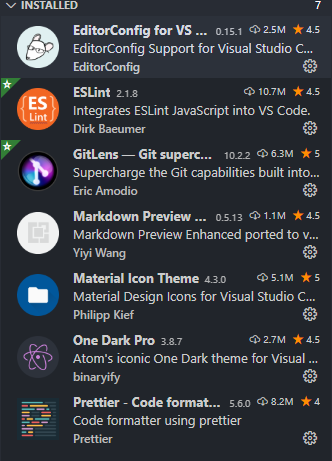

<!--
    Webpack configuration referrence.
    https://typescript-kr.github.io/pages/tutorials/react-&-webpack.html

    eslint + prettier configuration referrence.
    https://www.robertcooper.me/using-eslint-and-prettier-in-a-typescript-project
 -->

[![node][node]][node-url] [![npm][npm]][npm-url] [![typescript][typescript]][typescript-url] [![react][react]][react-url]

# 피터팬 비즈 프론트서비스

## Dev stack

<ol>
  <li>react.js</li>
  <li>typescript 4</li>
  <li>css-in-js (jss)</li>
  <li>material-ui</li>
</ol>

## Settings

add host `sudo vim /etc/hosts`

```sh
127.0.0.1       biz.local.com
```

## Run project

```sh
nvm use 12 # nvm을 사용할경우, 방어코드
npm install & npm run dev
```

then open `http://biz.local.com:3000/`

## Build

```sh
nvm use 12 # nvm을 사용할경우, 방어코드
npm run build:dev
npm run build:prod
```

## Included helper tools

- webpack dev server with [HMR][hmr-url]
- eslint + prettier (auto formatting)
- vscode setting file (theme, etc configs)

## Folder structure

```
├── build                   # Compiled files (distributions)
├── docs                    # Documentation files (alternatively `doc`)
├── src                     # Source files (alternatively `lib` or `app`)
│   ├─
│   ├─
│   └─
├── types                   # internal type definition root folder
└──
```

### VScode custom setting

[.vscode/settings.json](./docs/vscode_settings.json.md)
VSCode Theme: `One Dark Pro`

### Recommends VScode extensions



[node]: https://img.shields.io/badge/node-^12.18.3-green
[node-url]: https://nodejs.org/en/
[npm]: https://img.shields.io/badge/npm-^6.14.6-red
[npm-url]: https://npmjs.com/package/npm
[typescript]: https://img.shields.io/badge/typescript-^4.0.2-blue
[typescript-url]: https://www.npmjs.com/package/typescript
[react]: https://img.shields.io/badge/react-^16.13.1-blue
[react-url]: https://www.npmjs.com/package/react
[hmr-url]: https://webpack.js.org/concepts/hot-module-replacement
